# Executive Summary: Enterprise Observability Platform

## 🚀 Vision
To enable **"Zero-Code Observability"** across the entire microservices fleet, ensuring that every service—regardless of team or tech stack—automatically emits high-quality, correlated telemetry (Logs, Metrics, Traces) from day one.

## 💼 Business Value
*   **Reduced MTTR (Mean Time To Recovery):** Instant root cause analysis with end-to-end tracing (Browser → API → DB). No more "finding the needle in the haystack."
*   **No Vendor Lock-in:** Built on **OpenTelemetry (OTLP)** standards for the default pipeline. Dynatrace is supported via its **native Micrometer registry** (direct Metrics API push) — switchable with one config change, zero code changes.
*   **Standardization:** Enforces a unified "Observability Contract" (standard headers, log formats, and metric names) across the organization, eliminating data silos.
*   **Developer Productivity:** Developers focus on business logic, not boilerplate. They add **one dependency**, and the platform handles the rest.

## 📐 High-Level Architecture (AWS / EKS)
Full end-to-end trace from the user's browser click to the database query — visible in a single unified view.

```mermaid
graph TD
    subgraph FE["Frontend (Browser)"]
        Browser["User Browser<br/>(React / Angular)"]
        SDK["observability-client-js<br/>initTracing({ backend: 'otel' | 'dynatrace' })"]
    end

    subgraph AWS["AWS — EKS Cluster"]
        ALB["ALB / API Gateway<br/>(W3C TraceContext propagation)"]
        subgraph Pod["Microservice Pod"]
            App["Spring Boot App<br/>+ observability-starter"]
            Sidecar["OTel Collector<br/>(sidecar)"]
        end
        FluentBit["Fluent Bit<br/>(DaemonSet)"]
    end

    subgraph AWSBackends["AWS Managed Backends"]
        XRay["AWS X-Ray<br/>(Traces)"]
        AMP["Amazon Managed<br/>Prometheus — AMP<br/>(Metrics)"]
        CWLogs["CloudWatch Logs<br/>(Logs)"]
    end

    subgraph DT["Dynatrace (SaaS)"]
        DTTraces["Dynatrace OTLP Ingest<br/>(Traces via OTel Collector)"]
        DTMetrics["Dynatrace<br/>Native Metrics API"]
        DTDavis["Davis AI<br/>(Anomaly Detection)"]
        DTRUM["Dynatrace RUM<br/>+ Session Replay"]
    end

    AMG["Amazon Managed<br/>Grafana — AMG"]

    Browser -->|"HTTP + traceparent header"| ALB
    SDK -.->|"OneAgent RUM script<br/>(native JS tag)"| DTRUM
    Browser -.- SDK

    ALB -->|"Propagates trace headers"| App
    App -->|OTLP| Sidecar
    App -.->|"Native Metrics API<br/>(micrometer-registry-dynatrace)"| DTMetrics
    App -->|JSON Logs| FluentBit

    Sidecar -->|"Traces (OTLP)"| XRay
    Sidecar -->|"Traces (OTLP)"| DTTraces
    Sidecar -->|Metrics| AMP
    FluentBit -->|Logs| CWLogs

    XRay --> AMG
    AMP --> AMG
    CWLogs --> AMG

    DTTraces --> DTDavis
    DTMetrics --> DTDavis

    style Browser fill:#2d6a4f,color:#fff
    style SDK fill:#52b788,color:#fff
    style ALB fill:#457b9d,color:#fff
    style App fill:#1d3557,color:#fff
    style Sidecar fill:#457b9d,color:#fff
    style AMG fill:#e63946,color:#fff
    style DTTraces fill:#73b5e3,color:#000
    style DTMetrics fill:#73b5e3,color:#000
    style DTDavis fill:#73b5e3,color:#000
    style DTRUM fill:#73b5e3,color:#000
```

## 🏗 Key Capabilities

### 1. Zero-Touch Correlation
*   **Automatic ID Injection:** Every request gets a unique `trace_id` — from browser click to DB query, one continuous trace.
*   **Context Propagation:** IDs automatically flow across thread boundaries, async tasks, and HTTP calls to downstream services.
*   **Unified Logs:** Every log line includes `correlation_id`, `service`, `env`, and `version` automatically. No more unidentifiable logs.

### 2. End-to-End Visibility (Browser → API → DB)
*   **`observability-client-js`:** A lightweight client SDK that instruments the browser. Injects `traceparent` + `X-Correlation-Id` headers on every `fetch()` / Axios call, linking frontend user sessions to backend traces.
*   **Pluggable Tracing Backend:** Call `initTracing({ backend: 'otel' })` or `initTracing({ backend: 'dynatrace' })` — one line swaps the entire telemetry pipeline with no other code changes.
*   **Session Linking:** Frontend user sessions (RUM) are correlated to backend traces, bridging Customer Experience and Backend Performance.

#### OTel JS SDK vs. RUM Agent

**RUM (Real User Monitoring)** is a superset of tracing — it captures the full user experience, not just technical spans.

| Capability | OTel JS SDK (Traces only) | RUM Agent (Dynatrace / Full picture) |
|---|:---:|:---:|
| HTTP call durations | ✅ | ✅ |
| Error stack traces | ✅ | ✅ |
| W3C `traceparent` header injection | ✅ | ✅ |
| Session recording / replay | — | ✅ |
| User journey / click heatmaps | — | ✅ |
| Core Web Vitals (LCP, CLS, FID) | — | ✅ |
| Geographic & device breakdown | — | ✅ |
| Business KPIs (conversion funnels) | — | ✅ |
| Cost | Free (OSS) | Per-session (check Dynatrace contract) |

> **Recommendation:** Use OTel JS SDK (`backend: 'otel'`) for trace correlation at zero cost. Upgrade to Dynatrace RUM (`backend: 'dynatrace'`) when you need session replay, user journey analytics, or Core Web Vitals reporting.

### 3. Pluggable Backend Architecture
*   **OTel Collector (sidecar):** Fans out telemetry to multiple backends simultaneously — AWS X-Ray + AMP — with no application changes.
*   **AWS Managed Stack (EKS):** X-Ray (traces) + AMP (metrics) + CloudWatch Logs — all serverless managed, zero infra ops.
*   **Dynatrace (SaaS):** Davis AI anomaly detection, session replay, and deep APM. Metrics are pushed directly from the app via Micrometer's **native Dynatrace registry** (`micrometer-registry-dynatrace`) — bypassing the OTel Collector. Frontend RUM uses the **OneAgent JS script** (native, not OTLP).
*   **Amazon Managed Grafana (AMG):** Single pane of glass — unified dashboards across X-Ray, AMP, and CloudWatch Logs.

### 4. Governance & Cost Control
*   **Centralized Sampling:** Control trace volume (1% vs 100%) centrally in the OTel Collector to manage costs.
*   **Metric Allow-listing:** Distinct toggles to enable/disable costly metric exports per service.

## 🏆 Success Metrics (Example)
*   **Adoption:** 0 to 100% observability coverage in < 1 sprint per service.
*   **Efficiency:** 50% reduction in debugging time for distributed transaction failures.
*   **Quality:** 100% of P1 errors now have an associated Trace ID for immediate analysis.
