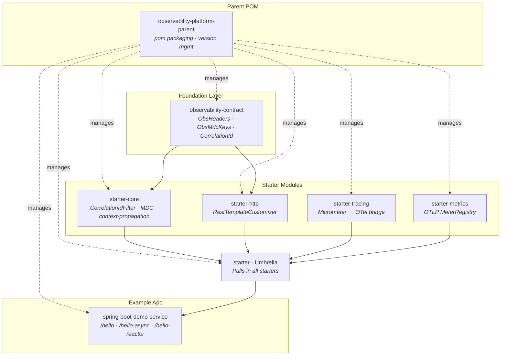
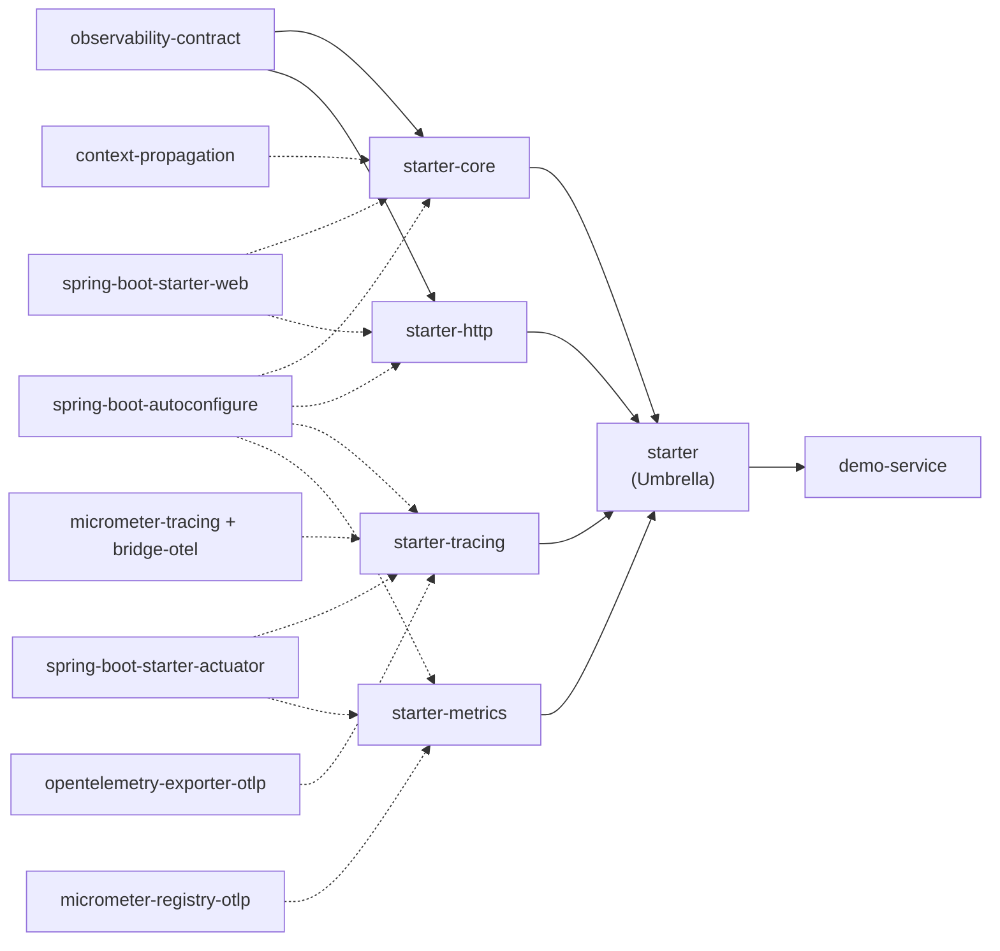
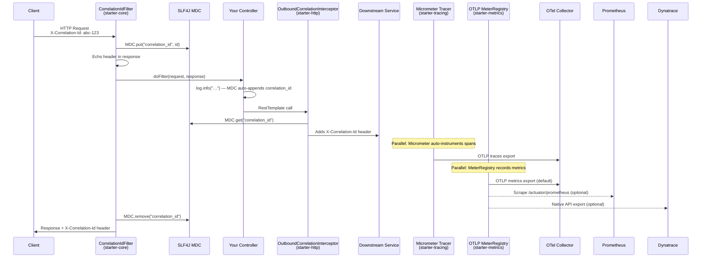
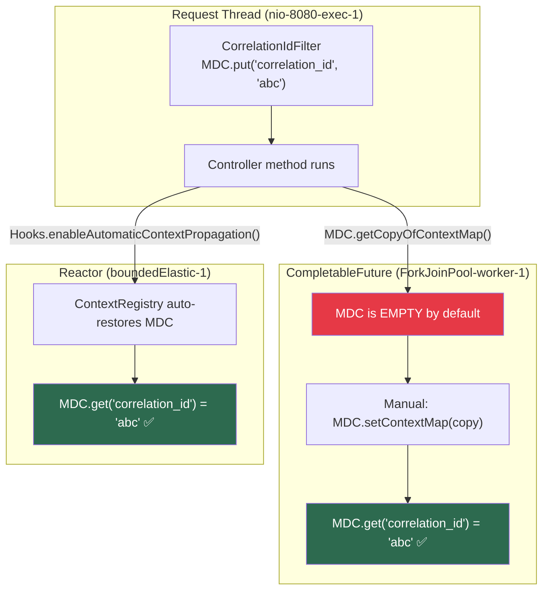
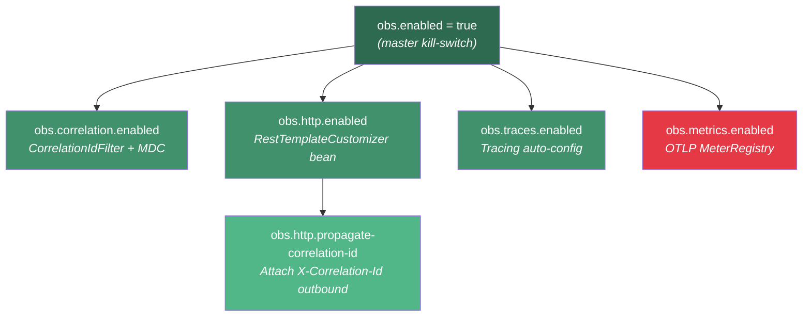

# Observability Platform — Architecture Walkthrough

## 1. High-Level Module Structure



**How to read this:** Solid arrows = compile dependency. Dotted arrows = parent POM management. The parent controls versions but modules are independently deployable JARs.

---

## 2. Module Dependency Graph



> [!IMPORTANT]
> `context-propagation` is pulled in by `starter-core`, making MDC bridging available to every service that uses any starter.

---

## 3. Request Data Flow



---

## 4. MDC Thread Propagation

MDC is `ThreadLocal`-based. This diagram shows how context crosses thread boundaries:



| Scenario | Propagation | Mechanism |
|---|---|---|
| Same servlet thread | ✅ Automatic | ThreadLocal |
| Reactor schedulers | ✅ Automatic | `ContextRegistry` + `Hooks.enableAutomaticContextPropagation()` |
| `CompletableFuture` | ❌ Manual | `MDC.getCopyOfContextMap()` → `MDC.setContextMap()` |
| `@Async` | ❌ Manual | `TaskDecorator` wrapping |

---

## 5. Feature Toggle Tree



> [!NOTE]
> `obs.metrics.enabled` defaults to **false** (red) — opt-in for cost governance. All others default to **true**.

---

## 6. Production Deployment Topology

```mermaid
graph LR
    subgraph "Your Microservice (Pod / ECS Task)"
        App["Spring Boot App<br/>+ observability-spring-boot-starter"]
        Sidecar["OTel Collector<br/>(sidecar / gateway)"]
    end

    App -->|OTLP gRPC<br/>localhost:4317| Sidecar
    App -->|Structured JSON logs<br/>stdout| LogPipeline["Log Pipeline<br/>(FluentBit / Filebeat)"]

    Sidecar -->|Traces| Tempo["Tempo / Jaeger / X-Ray"]
    Sidecar -->|Metrics| Prometheus["Prometheus / CloudWatch"]
    LogPipeline -->|Logs| Loki["Loki / CloudWatch Logs / ELK"]

    Tempo --> Grafana["Grafana Dashboard"]
    Prometheus --> Grafana
    Loki --> Grafana

    style App fill:#1d3557,color:#fff
    style Sidecar fill:#457b9d,color:#fff
    style Grafana fill:#e63946,color:#fff

### Alternative: Direct / Native Export
For environments where a sidecar is not possible, or when using vendor-specific agents (e.g., Dynatrace OneAgent):

```mermaid
graph LR
    App["Spring Boot App"]
    
    App -->|Scrape| Prometheus
    App -.->|Native API| Dynatrace
```
```

**Key architectural decision:** Application exports OTLP to a **local** Collector sidecar — never directly to backends. This decouples the app from backend choices and allows buffering, retries, and sampling at the Collector layer.

---

## 7. Class-Level Detail by Module

### [observability-contract](file:///Users/sanoopbhaskerv/workspace/observability_platform/observability-platform-maven-template/observability-contract)
| Class | Purpose |
|---|---|
| [ObsHeaders](file:///Users/sanoopbhaskerv/workspace/observability_platform/observability-platform-maven-template/observability-contract/src/main/java/com/yourorg/observability/contract/ObsHeaders.java) | HTTP header constants: `X-Correlation-Id`, `traceparent`, `X-Client-Request-Id`, `X-Session-Id` |
| [ObsMdcKeys](file:///Users/sanoopbhaskerv/workspace/observability_platform/observability-platform-maven-template/observability-contract/src/main/java/com/yourorg/observability/contract/ObsMdcKeys.java) | MDC key constants: `correlation_id`, `trace_id`, `span_id` |
| [CorrelationId](file:///Users/sanoopbhaskerv/workspace/observability_platform/observability-platform-maven-template/observability-contract/src/main/java/com/yourorg/observability/contract/CorrelationId.java) | Extract correlation ID from header or generate UUID |

### [starter-core](file:///Users/sanoopbhaskerv/workspace/observability_platform/observability-platform-maven-template/observability-spring-boot-starter-core)
| Class | Purpose |
|---|---|
| [ObservabilityCoreAutoConfiguration](file:///Users/sanoopbhaskerv/workspace/observability_platform/observability-platform-maven-template/observability-spring-boot-starter-core/src/main/java/com/yourorg/observability/starter/core/ObservabilityCoreAutoConfiguration.java) | Registers `CorrelationIdFilter` as highest-precedence servlet filter |
| [CorrelationIdFilter](file:///Users/sanoopbhaskerv/workspace/observability_platform/observability-platform-maven-template/observability-spring-boot-starter-core/src/main/java/com/yourorg/observability/starter/core/CorrelationIdFilter.java) | Extracts/generates correlation ID → MDC + response header |
| `ObsCoreProperties` | Config: `obs.correlation.header-name` (default: `X-Correlation-Id`) |

**Dependency:** Ships `context-propagation` for MDC bridging across threads.

### [starter-http](file:///Users/sanoopbhaskerv/workspace/observability_platform/observability-platform-maven-template/observability-spring-boot-starter-http)
| Class | Purpose |
|---|---|
| [ObservabilityHttpAutoConfiguration](file:///Users/sanoopbhaskerv/workspace/observability_platform/observability-platform-maven-template/observability-spring-boot-starter-http/src/main/java/com/yourorg/observability/starter/http/ObservabilityHttpAutoConfiguration.java) | Registers `RestTemplateCustomizer` that adds the interceptor |
| [OutboundCorrelationInterceptor](file:///Users/sanoopbhaskerv/workspace/observability_platform/observability-platform-maven-template/observability-spring-boot-starter-http/src/main/java/com/yourorg/observability/starter/http/OutboundCorrelationInterceptor.java) | Copies correlation ID from MDC to outgoing HTTP headers |

### [starter-tracing](file:///Users/sanoopbhaskerv/workspace/observability_platform/observability-platform-maven-template/observability-spring-boot-starter-tracing)
| Class | Purpose |
|---|---|
| [ObservabilityTracingAutoConfiguration](file:///Users/sanoopbhaskerv/workspace/observability_platform/observability-platform-maven-template/observability-spring-boot-starter-tracing/src/main/java/com/yourorg/observability/starter/tracing/ObservabilityTracingAutoConfiguration.java) | Presence-based toggle; actual tracing via Micrometer + OTel bridge |

### [starter-metrics](file:///Users/sanoopbhaskerv/workspace/observability_platform/observability-platform-maven-template/observability-spring-boot-starter-metrics)
| Class | Purpose |
|---|---|
| [ObservabilityMetricsAutoConfiguration](file:///Users/sanoopbhaskerv/workspace/observability_platform/observability-platform-maven-template/observability-spring-boot-starter-metrics/src/main/java/com/yourorg/observability/starter/metrics/ObservabilityMetricsAutoConfiguration.java) | Creates `OtlpConfig` + `OtlpMeterRegistry` beans |

### [demo-service](file:///Users/sanoopbhaskerv/workspace/observability_platform/observability-platform-maven-template/examples/spring-boot-demo-service)
| Class | Purpose |
|---|---|
| [DemoApplication](file:///Users/sanoopbhaskerv/workspace/observability_platform/observability-platform-maven-template/examples/spring-boot-demo-service/src/main/java/com/yourorg/observability/demo/DemoApplication.java) | Enables `Hooks.enableAutomaticContextPropagation()` + registers MDC with `ContextRegistry` |
| [HelloController](file:///Users/sanoopbhaskerv/workspace/observability_platform/observability-platform-maven-template/examples/spring-boot-demo-service/src/main/java/com/yourorg/observability/demo/HelloController.java) | Three demo endpoints: `/hello`, `/hello-async`, `/hello-reactor` |

---

## 8. Tech Stack

| Layer | Technology | Version |
|---|---|---|
| Framework | Spring Boot | 3.4.1 |
| Metrics | Micrometer Core | 1.14.3 |
| Tracing | Micrometer Tracing | 1.4.3 |
| Telemetry | OpenTelemetry API | 1.44.1 |
| Context | Micrometer Context Propagation | (managed by Spring BOM) |
| Reactor | Project Reactor | (managed by Spring BOM) |
| Java | JDK | 17+ |

---

## Source

GitHub: [sanoopbhaskerv/observability-platform](https://github.com/sanoopbhaskerv/observability-platform)
