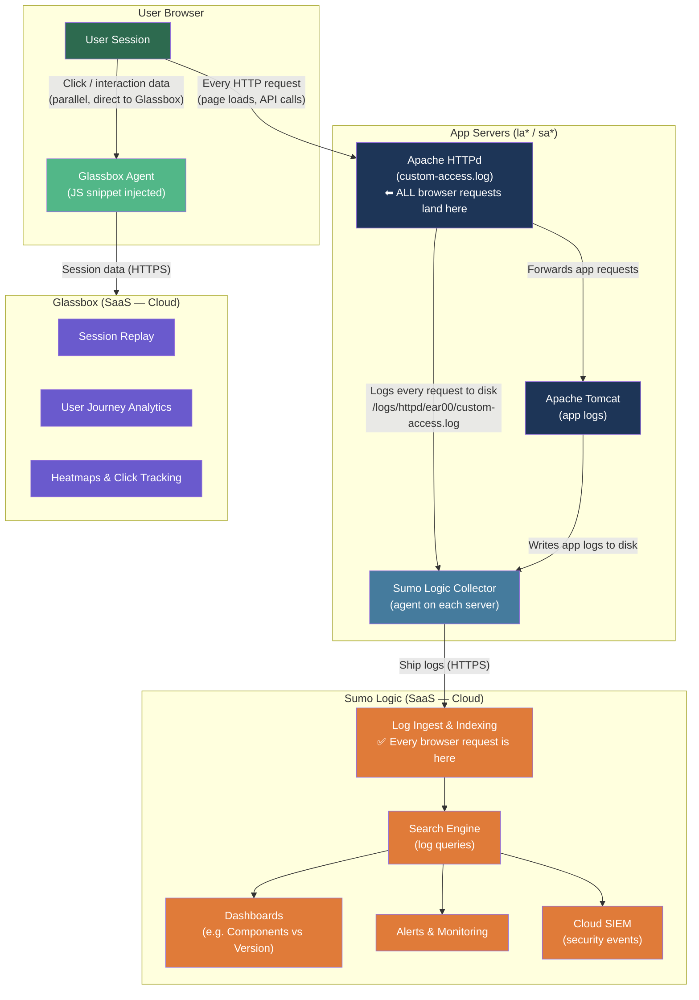
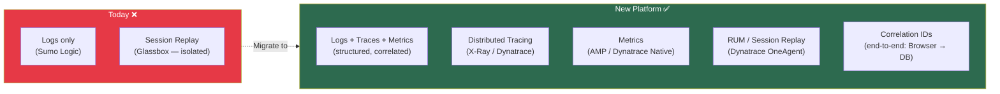

# Current Observability Architecture (Today)

## Overview

Today's observability is **log-centric** — applications write logs to disk, a Sumo Logic Collector agent ships them to Sumo Logic cloud, and teams query/dashboard from there. Frontend session replay is handled separately by **Glassbox**.

---

## Architecture Diagram

---

## What Exists Today

| Signal | Tool | How it gets there |
|---|---|---|
| **Application Logs** | Sumo Logic | Apache/Tomcat write to disk → Sumo Collector agent ships to cloud |
| **Frontend Session Replay** | Glassbox | JS snippet injected into browser → streams directly to Glassbox SaaS |
| **Log Search & Dashboards** | Sumo Logic | Teams write SPL queries (like `parse field=_raw` you see in log-search) |
| **Security Events** | Sumo Cloud SIEM | Derived from the same log stream |
| **Distributed Tracing** | ❌ None | Not available today |
| **Metrics Pipeline** | ❌ None | Inferred from log queries only |
| **Correlation across services** | ❌ None | No trace/correlation IDs flowing between services |

---

## Key Gaps vs the New Platform

